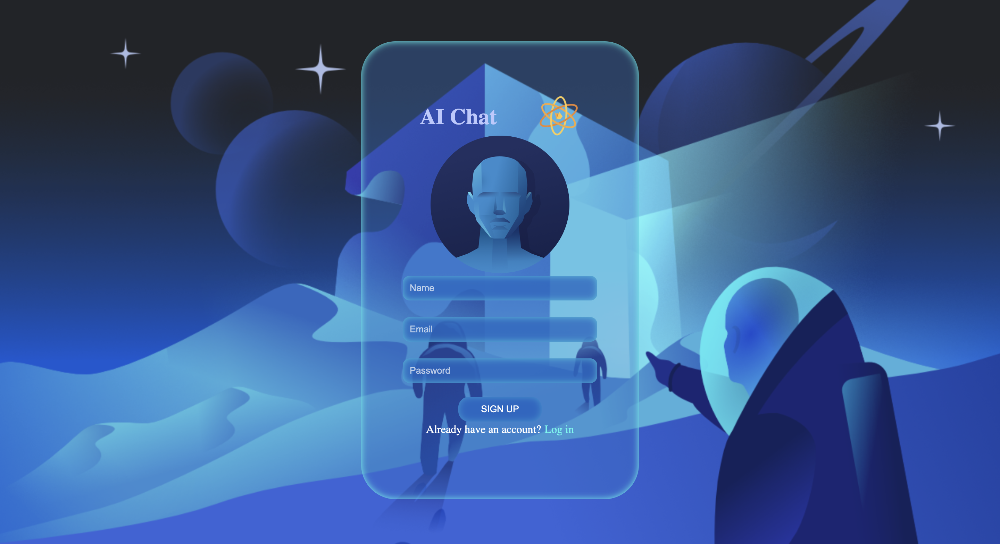
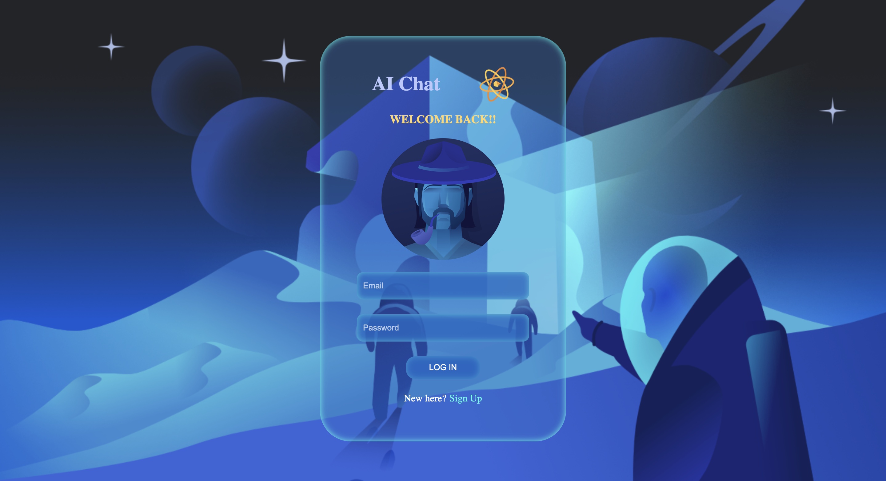
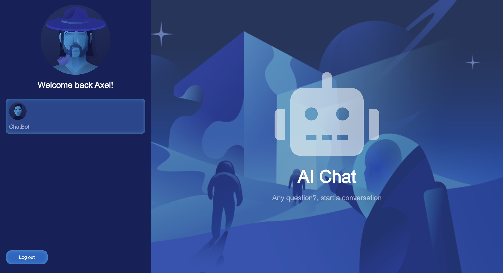
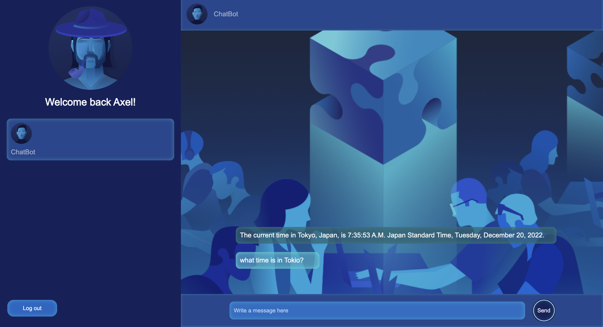

#Full Stack Web Application | AI Chat 🤖

<p align="center">
Our AI chat bot is a cutting-edge technology that allows users to have intelligent conversations with an artificial intelligence. It can answer questions, provide information, and even engage in casual conversation just like a human would.
This is a Next.js web app and Express, using MondoDB as database and Wolfram Alpha AI API.

## Technologies

### Next.js                  
### JavaScript
### Express
### Mongo DB
### JSON Web Token
### Bcryptjs
### Mongoose
### Node.js
### Wolfram Alpha AI API


##
## Sign Up




##
## Log In




##
## Before Chat




##
## Chat




## Get Started

1. Clone this repository and run:
```sh
npm install
```
2. Run the web server:
```sh
npm run server
```
3. Run the web app:
```sh
npm run dev
```


